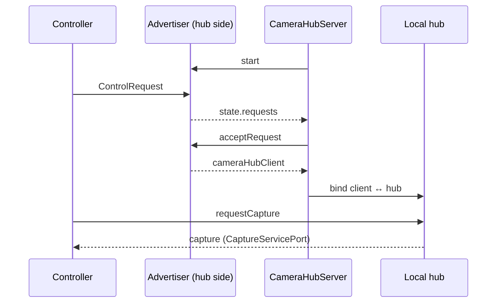

# RemoteCameraCore

The domain core for a remote camera system: one device (the **camera hub**) owns cameras and microphones, and other devices (**controllers**) discover it, connect, and drive capture remotely.

This package holds the shared model and the rules that connect the pieces. To allow maximum flexibility, it has **no transport, codec, or camera integration**. Networking, message serialization, and the actual capture pipeline are defined here as *ports* (protocols) and implemented by adapters in the app or in other packages.

## Requirements

- Swift 6.1+
- macOS 15 / iOS 17 / tvOS 15 / watchOS 8 / visionOS 2
- Combine (currently Apple platforms only)

## Installation

Add the package to `Package.swift`:

```swift
dependencies: [
  .package(url: "https://github.com/yu840915/RemoteCameraCore.git", branch: "main"),
],
targets: [
  .target(name: "YourTarget", dependencies: ["RemoteCameraCore"]),
]
```

It depends on [AsyncUtils](https://github.com/yu840915/AsyncUtils).

## Architecture

The package follows a ports-and-adapters layout. Each port is a service with the same shape:

| Protocol | Provides |
| --- | --- |
| `EventServicePort` | `onStatus`, `onEvent`, `onError`, `perform(_ command:)` |
| `StateServicePort` | the above, plus `state` and `onState` |
| `EventServiceClientPort` | `onStatus`, `onCommand`, `onError`, `notify(_:)`, `report(_:)`, `unbind(_:)` |
| `StateServiceClientPort` | the above, plus `update(_ state:)` |

A service takes **commands** and publishes **state** and **events**. Its client (usually the remote side of a connection) sends commands and receives state and events. Every node reports a `NodeStatus` (`preparing`, `ready`, `cancelled(Error?)`).

### Ports

| Port | Role | Commands | Events |
| --- | --- | --- | --- |
| `CameraHubServicePort` | A hub that lists its cameras and microphones | `requestCapture(args:)` | `capture(capture:)` |
| `CaptureServicePort` | A capture session on one camera, plus a stream of captured buffers | `start`, `stop`, `capturePhoto`, `startVideoRecording`, `startTimelapseRecording`, `stopRecording`, `cancelCapture`, `switchCamera`, `configure(commands:)`, `setMode` | `photoCaptured` |
| `CameraHubAdvertisingServicePort` | Advertises a hub and collects incoming `ControlRequest`s | `start`, `stop`, `acceptRequest` | `cameraHubClient(_:)` |
| `CameraHubDiscoveryServicePort` | Finds hubs from the controller side | `start`, `stop`, `requestHub(args:)` | `cameraHub(hub:)` |
| `MessageEncodingServicePort` / `MessageDecodingServicePort` | Serialization of any message to and from a transport's data type | — | — |

Each port also has a `…Coders` namespace of typealiases naming the encoders and decoders an adapter needs, for example `CaptureServiceCoders.StateEncoder<Data>`. Messages on the wire are wrapped in a `MessageFrame` (channel ID, message type, payload).

### Connection flow



### Implemented in this package

- **`CameraHubServer`**: runs on the hub device. It wraps a local `CameraHubServicePort` and an advertiser from a `CameraHubAdvertiserFactoryPort`. It creates a binding for every accepted controller and exposes `CameraHubServerState` (`isAdvertising`, `requests`, `connectedControllers`). Commands: `startAdvertising`, `stopAdvertising`, `acceptRequest(request:)`, `disconnect(controller:)`.
- **`CameraHubServiceClientBinding`** and **`CaptureServiceClientBinding`**: actors that connect a service to a client. They route commands to the service and state and events back to the client, and they unbind when either side is cancelled or closes. Wait for teardown with `waitUnbound()`. The capture binding sends state as incremental `CaptureServiceStateUpdateMessage`s (see `CaptureServiceState.diff(from:)`) and forwards captured buffers.
- **`NodeStatusMerger`**: combines statuses. The result is `cancelled` if any input is, otherwise `preparing` if any input is, otherwise `ready`.

### Capture state

`CaptureServiceState` describes a capture session:

- `camera`, `microphones`, `mode` (`monitor`, `photo`, `video`, `audio`, `timelapse`)
- `configuration`: the current torch, flash, zoom, HDR, focus, exposure, ISO and white balance values
- `capabilities`: the supported modes and `ValueRange`s for those settings
- `availableCommands`, `availableConfigurationCommands`, `availableModes`: feature tables that say what the session supports right now
- `captureTasks`, `recordingTasks`: work in progress, with `TaskProgress`

Use `canPerform(_:)` to check a configuration command against both the feature table and the capability ranges before you send it. A client rebuilds state by applying update messages with `update(_:)`.

### Image geometry

These types are plain value types with no graphics framework dependency:

- `ImageOrientation`: EXIF-style orientation with rotation, mirroring and display-dimension helpers
- `VideoBufferInfo`: dimensions, orientation and `VideoMirroring` for a frame
- `ImagePlaneTransform`: an exact quarter-turn and flip transform. It composes and inverts without rounding error and uses the same coefficient convention as `CGAffineTransform`, so you can convert it at the UI layer.
- `DeviceDirection`, `ImageDimensions`, `Point`

Captured media is passed around as a `BufferWrapper`: an opaque buffer with a `TypeHint` (still image, video frame, audio frame, compressed frames, file). The adapter that created the buffer is responsible for casting it back.

## Usage

Running a hub server with your own adapters:

```swift
import RemoteCameraCore

let server = await CameraHubServer(
  localHub: myCameraHub,              // some CameraHubServicePort
  advertiserFactory: myAdvertiserFactory  // some CameraHubAdvertiserFactoryPort
)

let cancellable = server.onState.sink { state in
  for request in state.requests {
    Task { try await server.perform(.acceptRequest(request: request)) }
  }
}

try await server.perform(.startAdvertising)
```

Checking whether a configuration change is allowed:

```swift
let command = CaptureServiceCommand.ConfigurationCommand.setZoomFactor(factor: 2.0)
if capture.state.canPerform(command) {
  try await capture.perform(.configure(commands: [command]))
}
```

## Project layout

```
Sources/RemoteCameraCore/
├── Service/                   # Base service/client protocols, NodeStatus, ConnectionSuite
├── CameraHubPort/             # Hub service, client, binding
├── CameraHubServer/           # Hub-side server orchestrating advertiser and bindings
├── CameraHubAdvertisingPort/  # Advertising and control requests
├── CameraHubDiscoveryPort/    # Discovery from the controller side
├── CapturePort/               # Capture service, client, binding, state diffing
├── MessageCodingPort/         # Encoder/decoder ports, MessageFrame, ErrorMessage
├── Camera/, Microphone/       # Device descriptors
└── DataTypes/                 # Geometry, ranges, timestamps, task progress, …
```

## Testing

The tests use [Swift Testing](https://github.com/swiftlang/swift-testing):

```sh
swift test
```

Test doubles for the ports are in `Tests/RemoteCameraCoreTests/Mocks.swift`.

## License

RemoteCameraCore is available under the MIT License. See [LICENSE](LICENSE) for details.
